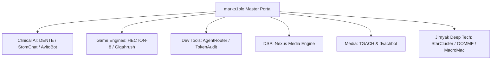

# Marko & Syndicate Master Architecture Specification

## 1. System Topology & Global Invariants
The marko1olo ecosystem integrates 30 high-performance engineering repositories spanning game engine internals, clinical healthcare platforms, digital signal processing, AI orchestration gateways, and astrophysical simulations.

## 2. Core Architectural Principles
- **Zero-GC Hot Paths:** All game loops and audio DSP work avoid heap allocations during frame processing.
- **Strict Data Contracts:** Zod schema validation at all REST and WebSocket boundaries.
- **PostgreSQL 18 Multi-Tenancy:** Hard partition isolation by `organization_id` on all database queries.
- **Deterministic AI Guardrails:** Multi-stage veto layers preventing hallucinations in clinical workflows.
